# ESPCN
A PyTorch implementation of ESPCN based on CVPR 2016 paper 
[Real-Time Single Image and Video Super-Resolution Using an Efficient Sub-Pixel Convolutional Neural Network](https://arxiv.org/abs/1609.05158).

## Requirements
- [Anaconda](https://www.anaconda.com/download/)
- PyTorch
```
conda install pytorch torchvision -c soumith
conda install pytorch torchvision cuda80 -c soumith # install it if you have installed cuda
```
- PyTorchNet
```
pip install git+https://github.com/pytorch/tnt.git@master
```
- opencv
```
conda install opencv
```

## Datasets

### Train、Val Dataset
The train and val datasets are sampled from [VOC2012](http://cvlab.postech.ac.kr/~mooyeol/pascal_voc_2012/).
Train dataset has 16700 images and Val dataset has 425 images.
Download the datasets from [here](https://pan.baidu.com/s/1xuFperu2WiYc5-_QXBemlA)(access code:5tzp), 
and then extract it into `data` directory. Finally run
```
python data_utils.py

optional arguments:
--upscale_factor      super resolution upscale factor [default value is 3]
```
to generate train and val datasets from VOC2012 with given upscale factors(options: 2、3、4、8).

### Test Image Dataset
The test image dataset are sampled from 
| **Set 5** |  [Bevilacqua et al. BMVC 2012](http://people.rennes.inria.fr/Aline.Roumy/results/SR_BMVC12.html)
| **Set 14** |  [Zeyde et al. LNCS 2010](https://sites.google.com/site/romanzeyde/research-interests)
| **BSD 100** | [Martin et al. ICCV 2001](https://www.eecs.berkeley.edu/Research/Projects/CS/vision/bsds/)
| **Sun-Hays 80** | [Sun and Hays ICCP 2012](http://cs.brown.edu/~lbsun/SRproj2012/SR_iccp2012.html)
| **Urban 100** | [Huang et al. CVPR 2015](https://sites.google.com/site/jbhuang0604/publications/struct_sr).
Download the image dataset from [here](https://pan.baidu.com/s/1vGosnyal21wGgVffriL1VQ)(access code:xwhy), and then extract it into `data` directory.

### Test Video Dataset
The test dataset are sampled from Jay Chou's Music Videos. Download the video dataset from 
[here](https://pan.baidu.com/s/12OrUPN9H1Grj4FTOxh9L1g)(access code:6rad), and then extract it into `data/test/SRF_xx/video` 
directory, which `xx` means the upscale factor.

## Usage

### Train

```
python -m visdom.server & python train.py

optional arguments:
--upscale_factor      super resolution upscale factor [default value is 3]
--num_epochs          super resolution epochs number [default value is 100]
```
Visdom now can be accessed by going to `127.0.0.1:8097` in your browser, 
or your own host address if specified.

If the above does not work, try using an SSH tunnel to your server by 
adding the following line to your local `~/.ssh/config` :
`LocalForward 127.0.0.1:8097 127.0.0.1:8097`.

Maybe if you are in China, you should download the static resources from 
[here](https://pan.baidu.com/s/1Ku7FByLLSnNxREnheU4TEA)(access code:vhm7), and put them on 
`~/anaconda3/lib/python3.6/site-packages/visdom/static/`.

### Test Image
```
python test_image.py

optional arguments:
--upscale_factor      super resolution upscale factor [default value is 3]
--model_name          super resolution model name [default value is epoch_3_100.pt]
```
The output high resolution images are on `results` directory.

### Test Video
```
python test_video.py

optional arguments:
--upscale_factor      super resolution upscale factor [default value is 3]
--is_real_time        super resolution real time to show [default value is False]
--delay_time          super resolution delay time to show [default value is 1]
--model_name          super resolution model name [default value is epoch_3_100.pt]
```
The output high resolution videos are on `results` directory.

## Benchmarks
Adam optimizer were used with learning rate scheduling between epoch 30 and epoch 80.

**Upscale Factor = 2**

Epochs with batch size of 64 takes ~1 minute on a NVIDIA GeForce TITAN X GPU. 

> Loss/PSNR graphs

<table>
  <tr>
    <td>
     
    </td>
    <td>
     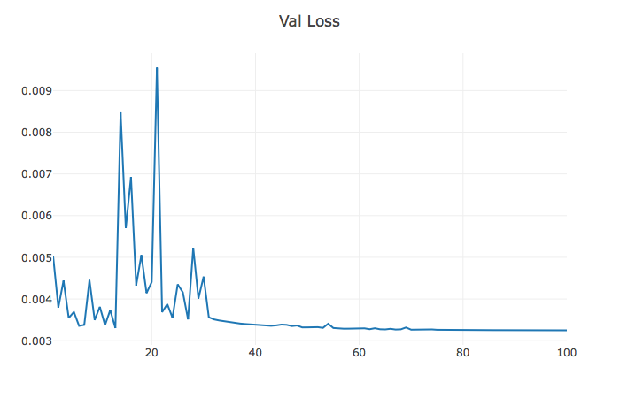
    </td>
  </tr>
</table>
<table>
  <tr>
    <td>
     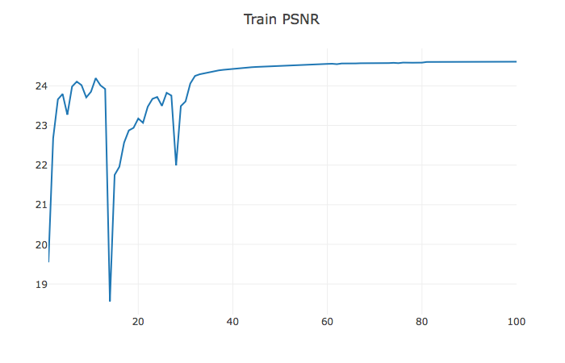
    </td>
    <td>
     
    </td>
  </tr>
</table>

> Image Results

The left is low resolution image, the middle is high resolution image, and 
the right is super resolution image(output of the ESPCN).

- Set5
<table>
  <tr>
    <td>
     
    </td>
    <td>
     
    </td>
    <td>
     
    </td>
  </tr>
</table>

- Set14
<table>
  <tr>
    <td>
     
    </td>
    <td>
     
    </td>
    <td>
     
    </td>
  </tr>
</table>

- BSD100
<table>
  <tr>
    <td>
     
    </td>
    <td>
     
    </td>
    <td>
     
    </td>
  </tr>
</table>

- Urban100
<table>
  <tr>
    <td>
     
    </td>
    <td>
     
    </td>
    <td>
     
    </td>
  </tr>
</table>

> Video Results

The right is low resolution video, the left is super resolution video(output of the ESPCN).
Click the image to watch the complete video.

[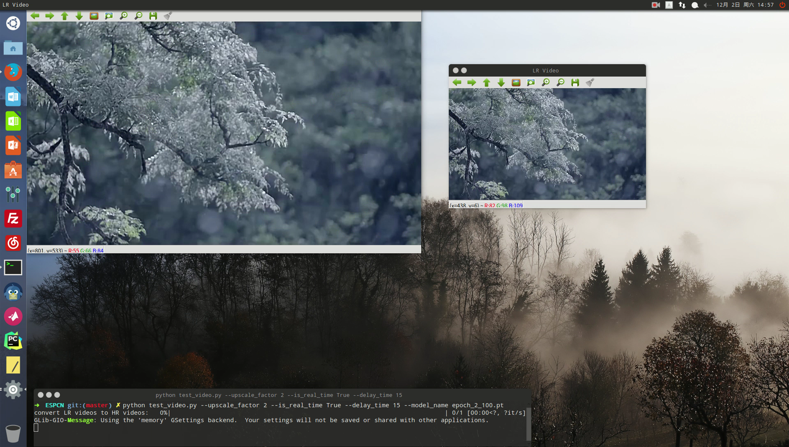](http://v.youku.com/v_show/id_XMzIwMDEyODU2MA==.html?spm=a2hzp.8244740.0.0)

**Upscale Factor = 3**

Epochs with batch size of 64 takes ~30 seconds on a NVIDIA GeForce TITAN X GPU. 

> Loss/PSNR graphs

<table>
  <tr>
    <td>
     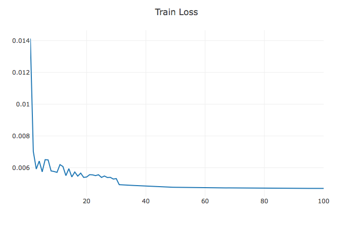
    </td>
    <td>
     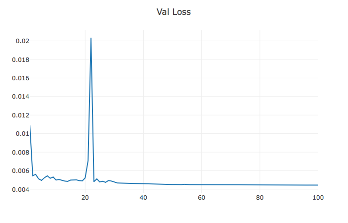
    </td>
  </tr>
</table>
<table>
  <tr>
    <td>
     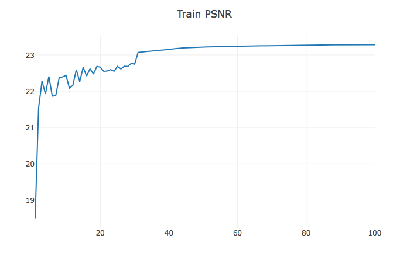
    </td>
    <td>
     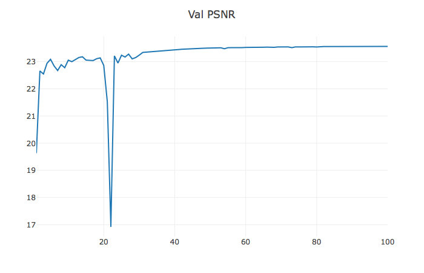
    </td>
  </tr>
</table>

> Image Results

The left is low resolution image, the middle is high resolution image, and 
the right is super resolution image(output of the ESPCN).

- Set5
<table>
  <tr>
    <td>
     
    </td>
    <td>
     
    </td>
    <td>
     
    </td>
  </tr>
</table>

- Set14
<table>
  <tr>
    <td>
     
    </td>
    <td>
     
    </td>
    <td>
     
    </td>
  </tr>
</table>

- BSD100
<table>
  <tr>
    <td>
     
    </td>
    <td>
     
    </td>
    <td>
     
    </td>
  </tr>
</table>

> Video Results

The right is low resolution video, the left is super resolution video(output of the ESPCN). 
Click the image to watch the complete video.

[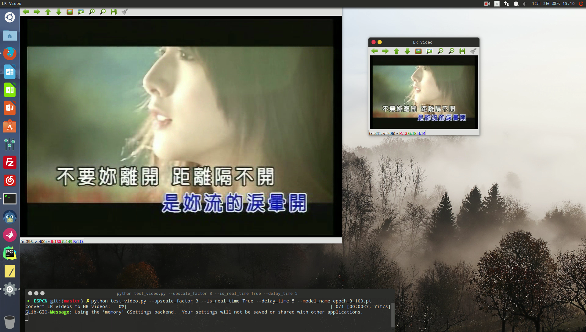](http://v.youku.com/v_show/id_XMzIwMDEzMjEyNA==.html?spm=a2hzp.8244740.0.0)

**Upscale Factor = 4**

Epochs with batch size of 64 takes ~20 seconds on a NVIDIA GeForce GTX 1070 GPU. 

> Loss/PSNR graphs

<table>
  <tr>
    <td>
     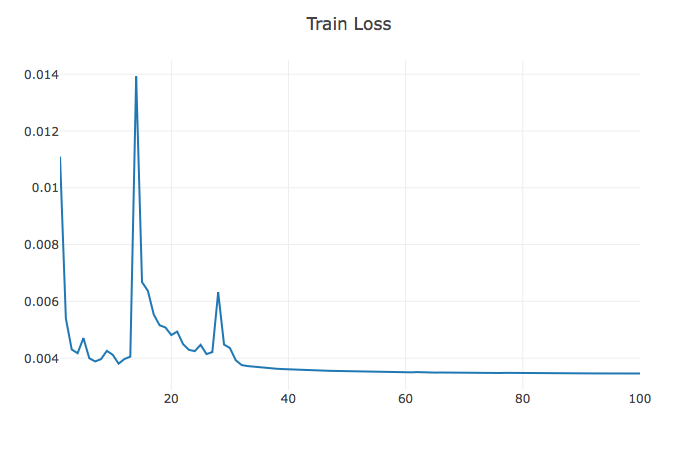
    </td>
    <td>
     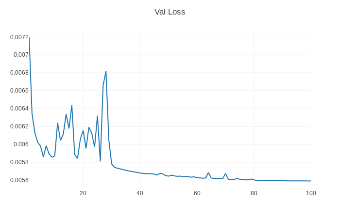
    </td>
  </tr>
</table>
<table>
  <tr>
    <td>
     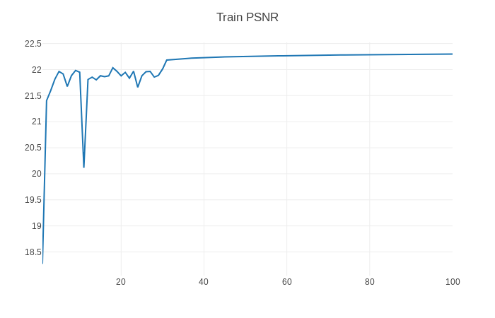
    </td>
    <td>
     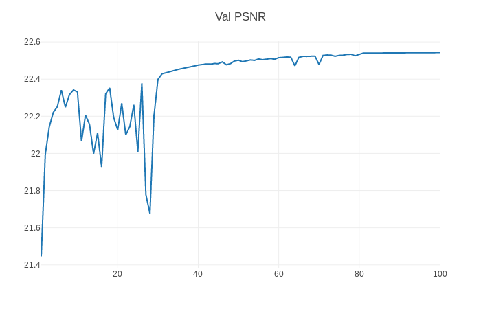
    </td>
  </tr>
</table>

> Image Results

The left is low resolution image, the middle is high resolution image, and 
the right is super resolution image(output of the ESPCN).

- Set5
<table>
  <tr>
    <td>
     
    </td>
    <td>
     
    </td>
    <td>
     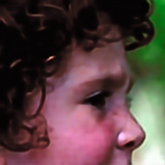
    </td>
  </tr>
</table>

- Set14
<table>
  <tr>
    <td>
     
    </td>
    <td>
     
    </td>
    <td>
     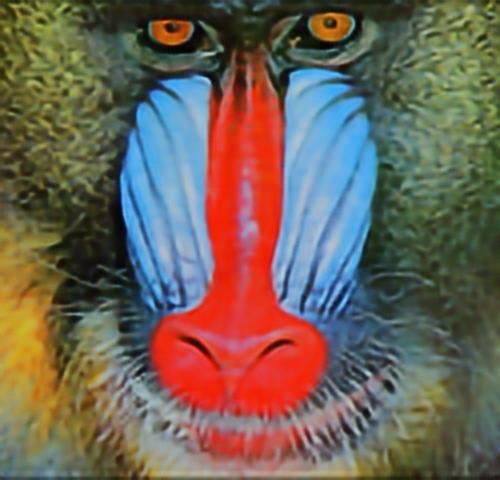
    </td>
  </tr>
</table>

- BSD100
<table>
  <tr>
    <td>
     
    </td>
    <td>
     
    </td>
    <td>
     
    </td>
  </tr>
</table>

- Urban100
<table>
  <tr>
    <td>
     
    </td>
    <td>
     
    </td>
    <td>
     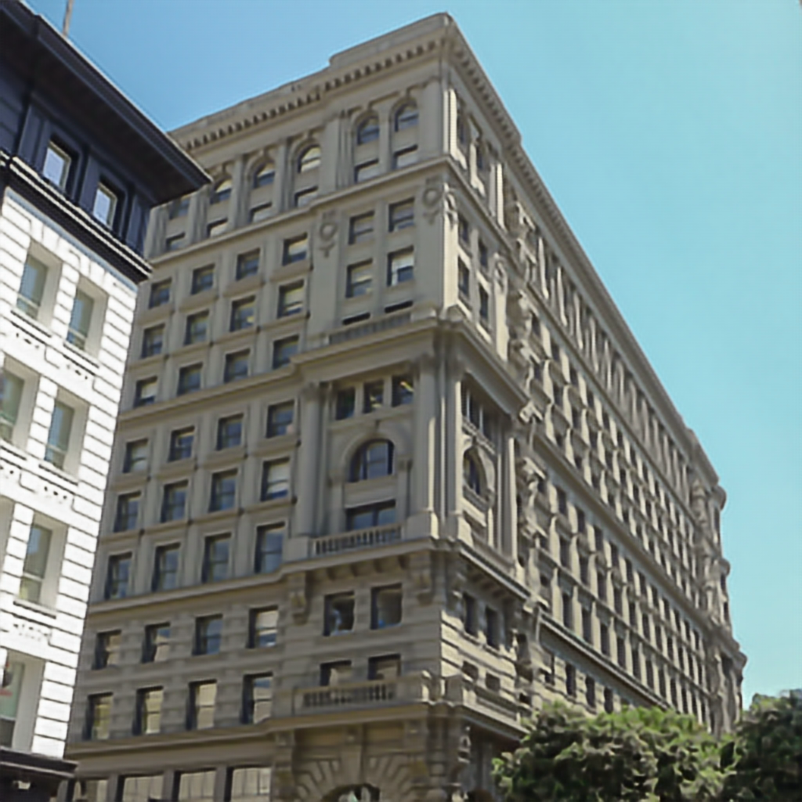
    </td>
  </tr>
</table>

> Video Results

The right is low resolution video, the left is super resolution video(output of the ESPCN).
Click the image to watch the complete video.

[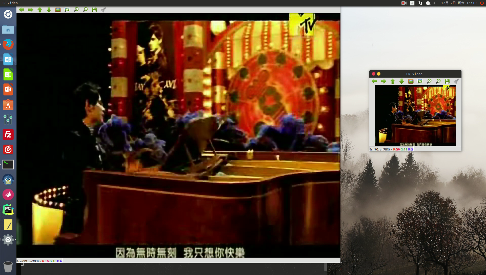](http://v.youku.com/v_show/id_XMzIwMDEzNDcxMg==.html?spm=a2hzp.8244740.0.0)

**Upscale Factor = 8**

Epochs with batch size of 64 takes ~15 seconds on a NVIDIA GeForce GTX 1070 GPU. 

> Loss/PSNR graphs

<table>
  <tr>
    <td>
     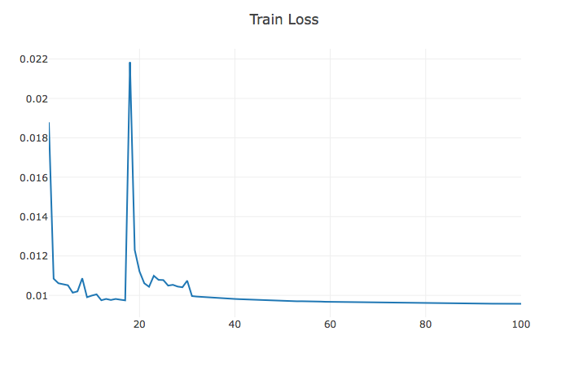
    </td>
    <td>
     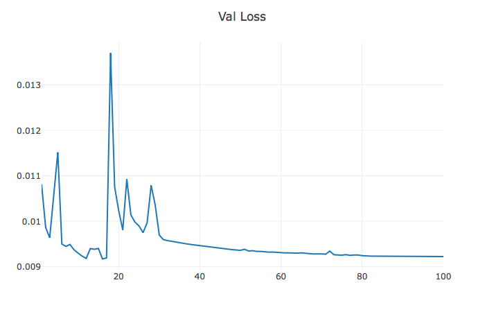
    </td>
  </tr>
</table>
<table>
  <tr>
    <td>
     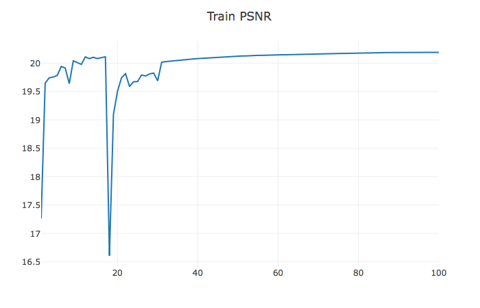
    </td>
    <td>
     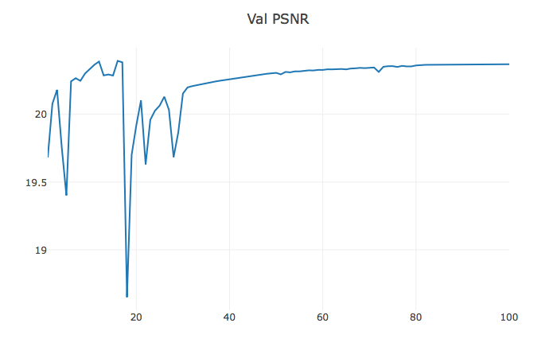
    </td>
  </tr>
</table>

> Image Results

The left is low resolution image, the middle is high resolution image, and 
the right is super resolution image(output of the ESPCN).

- SunHays80
<table>
  <tr>
    <td>
     
    </td>
    <td>
     
    </td>
    <td>
     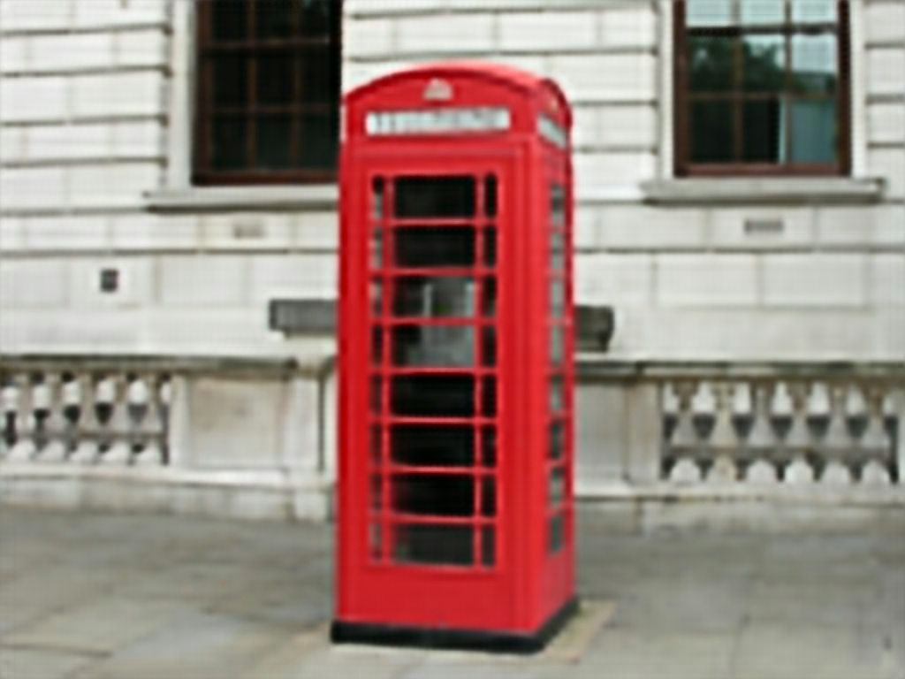
    </td>
  </tr>
</table>

> Video Results

The left is low resolution video, the right is super resolution video(output of the ESPCN).
Click the image to watch the complete video.

[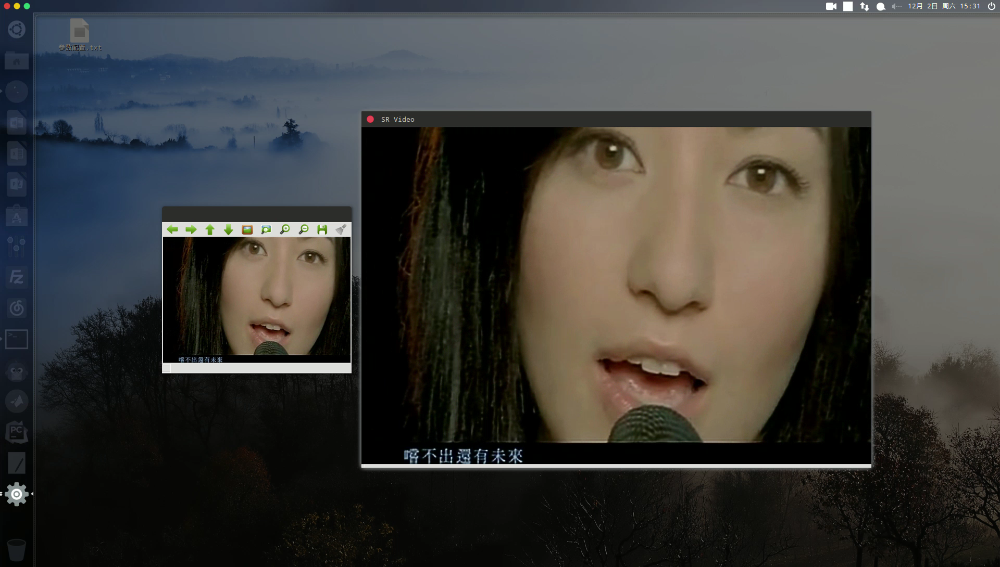](http://v.youku.com/v_show/id_XMzIwMDEzODMzNg==.html?spm=a2hzp.8244740.0.0)

The complete test image results could be downloaded from [here](https://pan.baidu.com/s/1tpi-X6KMrUM15zKTH7f_WQ)(access code:nkh9), and 
the complete test video results could be downloaded from [here](https://pan.baidu.com/s/1IgEbuaKpQpknjUEleTKtLA)(access code:1dus).
